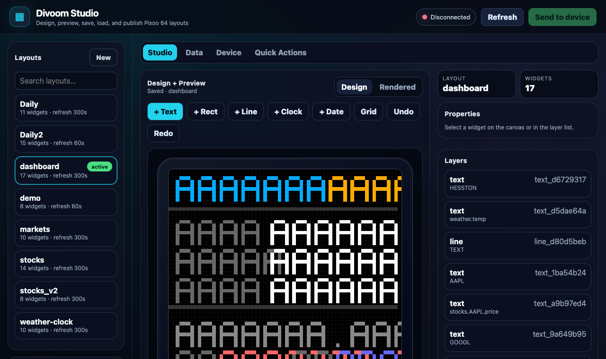
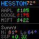
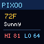
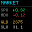

# Divoom Studio for Pixoo 64

A polished local web studio for Divoom Pixoo 64 displays: design 64×64 layouts, preview them in the browser, bind widgets to live weather/market data, save/load JSON layouts, and publish to the device on a schedule.



## Why this exists

The Pixoo 64 is great hardware with a tiny canvas and a lot of personality. Divoom Studio turns it into a small programmable dashboard without making you hand-edit pixels at 01:00 like a gremlin with a JSON habit.

Good fits:

- Home/lab dashboards
- Desk displays
- Weather + market tickers
- Raspberry Pi always-on controllers
- macOS/Linux desktop control stations
- Windows development/use should work too, though the service examples are Linux/systemd-specific
- Fast experimentation with Pixoo 64 layouts

Keywords: Divoom, Pixoo, Pixoo 64, LED matrix, Raspberry Pi, macOS, Windows, Linux, dashboard, home automation, FastAPI, pixel art.

## Highlights

- Browser-based Studio UI with a dark, responsive layout
- 64×64 design canvas plus rendered preview
- Save, load, duplicate, rename, import, export, and delete layouts
- Live data sources for Yahoo Finance market data and OpenWeatherMap weather
- Source editor with explicit error/debug details for failed API calls
- Conditional colors for positive/negative values
- Device discovery and direct Pixoo control
- CLI rendering to device or PNG files
- Safe `--no-device` mode for local UI work
- Dockerfile, compose example, systemd unit, and tag-based GitHub release workflow

## Screenshots / example layouts

| Studio | Dashboard | Weather | Markets |
|---|---|---|---|
|  |  |  |  |

The PNG previews are rendered by the project itself, not mocked artwork:

```bash
make render-examples
```

## Fast start

Divoom Studio is a Python app and works on macOS and Linux. Windows should work as well for local Studio/CLI use; the packaged always-on service instructions target Linux/systemd because that is the common Raspberry Pi deployment path.

### One-command local install

```bash
git clone https://github.com/jsperson/divoom_client.git
cd divoom_client
make install
make run
```

Open:

```text
http://localhost:8080
```

`make run` starts Studio in `--no-device` mode so you can edit and preview layouts before touching hardware.

### Connect a Pixoo 64

```bash
. .venv/bin/activate
divoom discover
divoom test
```

Then run without `--no-device`:

```bash
divoom serve config/layouts/dashboard.json --web --port 8080
```

### Raspberry Pi service install

From a Pi or Linux host:

```bash
git clone https://github.com/jsperson/divoom_client.git
cd divoom_client
make service-install
```

Then open:

```text
http://<pi-ip>:8080
```

The systemd unit runs:

```bash
divoom serve config/layouts/Daily2.json --web --port 8080
```

Edit `divoom@.service` if you want a different default layout.

## Docker

Build and run locally:

```bash
make docker-build
make docker-run
```

Or with Compose:

```bash
cp docker-compose.example.yml docker-compose.yml
docker compose up --build
```

The container runs Studio in `--no-device` mode by default. Mount `./config:/app/config` to persist layouts and data-source settings.

## Configuration

### Device config: `config/device.json`

Create from the example or run `divoom discover`:

```json
{
  "ip_address": "192.168.1.100",
  "brightness": 100
}
```

### Data sources: `config/datasources.json`

Start from the checked-in example:

```bash
cp config/datasources.example.json config/datasources.json
```

Example:

```json
{
  "sources": {
    "stocks": {
      "type": "stocks",
      "symbols": ["^GSPC", "^IXIC", "GC=F", "SI=F"],
      "refresh_seconds": 300,
      "enabled": true
    },
    "weather": {
      "type": "weather",
      "enabled": true,
      "api_key": "${OPENWEATHER_API_KEY}",
      "location": "Hesston,KS,US",
      "units": "imperial",
      "refresh_seconds": 600
    }
  }
}
```

Notes:

- OpenWeatherMap is picky. Use comma-separated locations like `Hesston,KS,US`.
- Credentials may be stored as environment references, e.g. `${OPENWEATHER_API_KEY}`.
- The Data tab can test each source and shows raw upstream errors with secrets redacted.

## CLI commands

```bash
divoom --help

# Device control
divoom discover
divoom test
divoom brightness 50
divoom on
divoom off
divoom clear --color "#000000"

# Render layouts
divoom render config/layouts/dashboard.json --data config/sample_data.demo.json --output preview.png
divoom render config/layouts/dashboard.json --ip 192.168.1.100

divoom live config/layouts/dashboard.json --output live-preview.png
divoom fetch all

# Studio server
divoom serve config/layouts/dashboard.json --web --port 8080 --no-device
divoom serve config/layouts/dashboard.json --web --port 8080
```

## Layout format

Layouts are plain JSON files under `config/layouts/`.

Minimal example:

```json
{
  "name": "hello-pixoo",
  "background": "#000000",
  "refresh_seconds": 300,
  "widgets": [
    {
      "type": "text",
      "x": 2,
      "y": 2,
      "font": "5x7",
      "text": "HELLO",
      "color": "#FFFFFF"
    },
    {
      "type": "text",
      "x": 2,
      "y": 14,
      "font": "4x6",
      "data_source": "weather.temp",
      "format": "{value}°",
      "color": "#FFAA00"
    }
  ]
}
```

Widget types:

- `text`: static text or a `data_source` binding
- `rect`: filled or outlined rectangle
- `line`: single-pixel line

Data paths:

- Stocks: `stocks.{SYMBOL}.price`, `stocks.{SYMBOL}.change`, `stocks.{SYMBOL}.percent`
- Weather: `weather.temp`, `weather.temp_min`, `weather.temp_max`, `weather.main`, `weather.humidity`

Conditional colors:

```json
{
  "color": {
    "conditions": [
      { "when": "stocks.AAPL.change < 0", "color": "#FF0000" },
      { "when": "stocks.AAPL.change >= 0", "color": "#00FF00" }
    ],
    "default": "#FFFFFF"
  }
}
```

## Development

```bash
make install
make test
make lint
make render-examples
```

Direct commands:

```bash
uv pip install -e ".[dev]"
pytest -q
ruff check src/divoom_client/web tests
python -m build
```

## Release packaging

This repo includes `.github/workflows/release.yml`.

When a tag like `v0.1.0` is pushed, GitHub Actions will:

- run tests
- build Python distribution artifacts
- create a GitHub release with generated notes
- build and push a Docker image to GitHub Container Registry

No tag, no release. A rare case where doing nothing is a feature.

## License

MIT License.
